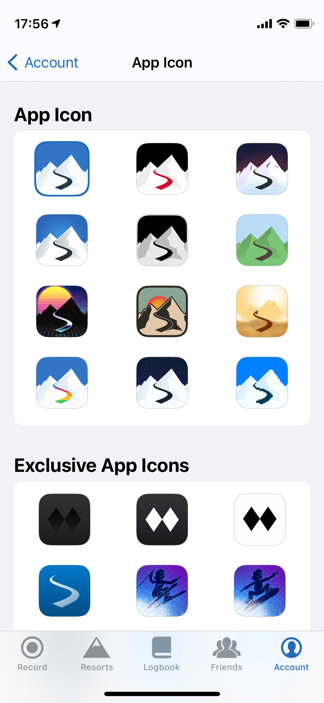
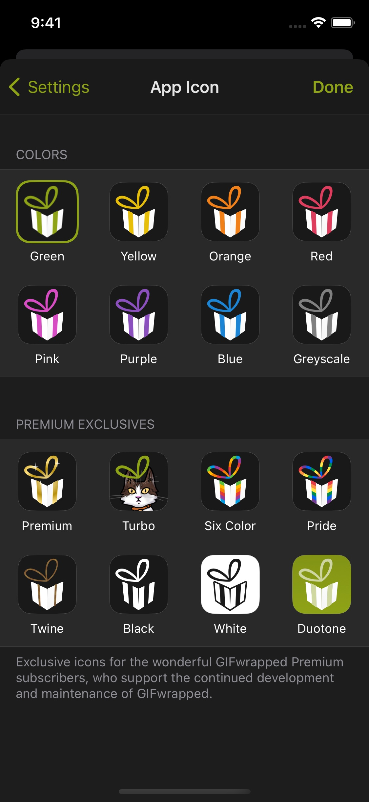

# IconSelector

A drop-in UI component to allow easy selection of alternate icons on iOS.

## Why?

Adding alternative icons to an iOS app isn't entirely straightforward, but it should be. It's tricky enough to add the entries to your Info.plist, let alone implement UI that you can display on both iPhone and iPad. This library takes care of that last part, and leaves you the much easier task of choosing the icons you want to add!

## Features

- Build on top of `UIControl`.
- Adjustable borders, padding, labels, etc.
- Drop in as-is, or use it to power custom UI.
- Compatible with iOS 10.3 and above.

<a href="resources/screenshot-slopes.jpeg"></a>
<a href="resources/screenshot-gifwrapped.jpeg"></a>

## Installation

### [Swift Package Manager](https://developer.apple.com/documentation/xcode/adding_package_dependencies_to_your_app) (for Apple platforms only)

In Xcode, select _File_ > _Swift Packages_ > _Add Package Dependency_ and enter the repository URL:

```
https://github.com/jellybeansoup/ios-icon-selector
```

### [Carthage](https://github.com/Carthage/Carthage)

Add the following line to your `Cartfile`:

```
github "jellybeansoup/ios-icon-selector"
```

## Getting Started

Begin by defining your alternate icons under the [`CFBundleIcons`](https://developer.apple.com/documentation/bundleresources/information_property_list/cfbundleicons) key within your app's `Info.plist` file. Don't forget to include an entry for your app's primary icon!

``` xml
<key>CFBundleIcons</key>
<dict>
	<key>CFBundleAlternateIcons</key>
	<dict>
		<key>blue</key>
		<dict>
			<key>CFBundleIconFiles</key>
			<array>
				<string>blue-20</string>
				<!-- Include all the relevant sizes! -->
			</array>
		</dict>
	</dict>
	<key>CFBundlePrimaryIcon</key>
	<dict>
		<key>CFBundleIconFiles</key>
		<array>
			<string>green-83.5</string>
			<!-- Include all the relevant sizes! -->
		</array>
	</dict>
</dict>
```

Next, instantiate the IconSelector and add it to your view heirarchy. The `IconSelector` class inherits from `UIControl`, so you'll also need to add a target/action pair to be notified when the user selects a different icon.

``` swift
// Goes at the top of the file.
import IconSelector

// Retrieve all the icons defined in your app's main bundle.
let icons = Icon.main

// Instantiate the IconSelector with a target/action combo, and add it to your view hierarchy.
let iconSelector = IconSelector(icons: icons)
iconSelector.addTarget(self, action: #selector(iconSelectorDidChange(_:)), for: .valueChanged)
view.addSubview(iconSelector)
```

Finally, implement the action needed to change the app's icon in response to the user's selection.

``` swift
@objc func iconSelectorDidChange(_ iconSelector: IconSelector) {
	guard UIApplication.shared.supportsAlternateIcons, let selectedIcon = iconSelector.selectedIcon else {
		return
	}

	UIApplication.shared.setAlternateIcon(selectedIcon, completionHandler: nil)
}
```

## Documentation

You can [find complete documentation for this project here](https://jellybeansoup.github.io/ios-icon-selector/). This documentation is automatically generated with [jazzy](https://github.com/realm/jazzy) from a [GitHub Action](.github/workflows/documentation.yml) and hosted with [GitHub Pages](https://pages.github.com/).

To generate documentation locally, run `make documentation` or `sh ./scripts/documentation.sh` from the repository's root directory. The output will be generated in the `docs` folder, and should _not_ be included with commits (as the online documentation is automatically generated and updated).

## Released under the BSD License

Copyright © 2021 Daniel Farrelly & Curtis Herbert

Redistribution and use in source and binary forms, with or without modification,
are permitted provided that the following conditions are met:

*	Redistributions of source code must retain the above copyright notice, this list
	of conditions and the following disclaimer.
*	Redistributions in binary form must reproduce the above copyright notice, this
	list of conditions and the following disclaimer in the documentation and/or
	other materials provided with the distribution.

THIS SOFTWARE IS PROVIDED BY THE COPYRIGHT HOLDERS AND CONTRIBUTORS "AS IS" AND 
ANY EXPRESS OR IMPLIED WARRANTIES, INCLUDING, BUT NOT LIMITED TO, THE IMPLIED
WARRANTIES OF MERCHANTABILITY AND FITNESS FOR A PARTICULAR PURPOSE ARE DISCLAIMED.
IN NO EVENT SHALL THE COPYRIGHT HOLDER OR CONTRIBUTORS BE LIABLE FOR ANY DIRECT,
INDIRECT, INCIDENTAL, SPECIAL, EXEMPLARY, OR CONSEQUENTIAL DAMAGES (INCLUDING,
BUT NOT LIMITED TO, PROCUREMENT OF SUBSTITUTE GOODS OR SERVICES; LOSS OF USE,
DATA, OR PROFITS; OR BUSINESS INTERRUPTION) HOWEVER CAUSED AND ON ANY THEORY OF
LIABILITY, WHETHER IN CONTRACT, STRICT LIABILITY, OR TORT (INCLUDING NEGLIGENCE
OR OTHERWISE) ARISING IN ANY WAY OUT OF THE USE OF THIS SOFTWARE, EVEN IF
ADVISED OF THE POSSIBILITY OF SUCH DAMAGE.
